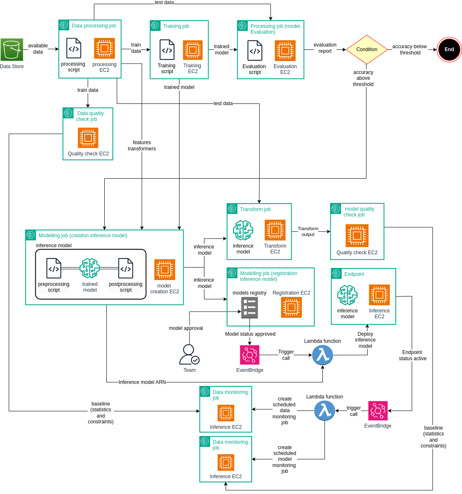

## Conceptual design
AWS sagemaker is used for orchestrating the machine learning pipeline.\

## Run the pipeline
The pipeline could run locally, but isn't recommended as sagemaker is primarily made to run machine learning systems on AWS cloud. \
Assuming a virtual env is created and equipped with all the dependencies in requirements.txt, execute:\
`bash run_pipeline.sh` \
The tests are automated using a github action. The tests can still be run locally:\
`bash run_tests.sh`
